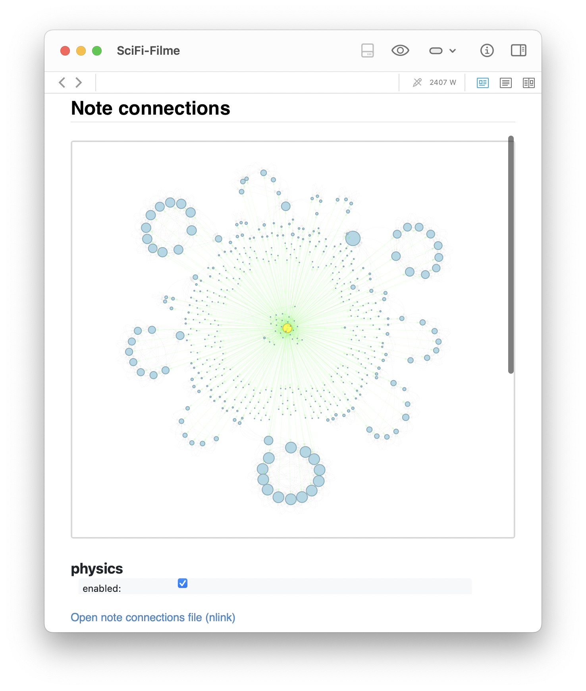

# DEVONthink Note Connections Graph
**Create and visualize dynamic link graphs of your Markdown notes in DEVONthink 3.**

This project provides a powerful integration between DEVONthink 3 and Python to automatically generate interactive HTML graphs of outgoing and incoming Wiki-links of your Markdown notes. The graphs are stored directly in your DEVONthink database and can update the source file to display an embed. Furthermore, you have the choice to visualize the graph with a static pre-calculated layout or activate a physics engine for dynamic interaction. This allows you to explore your knowledge network in a visually appealing and intuitive way, making it easier to discover connections between and clusters within your notes.



## 🚀 Features
* **Dynamic Graphs:** Generates interactive network graphs (based on `pyvis`/`vis.js`) of your Markdown note connections.  
* **Dual Graph Display:** The generated HTML file initially displays a static, pre-calculated connection graph (using `networkx`). Below this, there's an option to activate the physics engine (provided by `pyvis`), which simulates a more comprehensive and dynamic graph layout. This approach prioritizes initial load speed and offers the user control over computationally intensive simulations, which may not always be necessary as the `networkx` pre-calculation often provides good clustering. 
* **Intelligent Linking:** Analyzes outgoing and incoming [Wiki-links](http://localhost:8000/blog/2022-07-21-devonthink_wikilinks_and_aliases/) between Markdown documents.  
* **Scalable Visualization:** Dynamically adjusts layout and node sizes based on the number of notes.
* * **DEVONthink Embedding:** Saves the graph as `nlink_<UUID>.html` and optionally embeds it into the source Markdown note via `<iframe>`.
* **User-Friendly:** Launches directly from DEVONthink via an AppleScript.  
* **Parallelization:** The Python script utilizes `joblib` for faster link detection in large datasets.


## 🔗 Connection logic
This script focuses on visualizing a specific "neighborhood" of your selected Markdown note(s) to create a focused knowledge network. Here's how connections are analyzed and included:

* **Direct Links:** All **outgoing and incoming Wiki-links** directly connected to your **selected Markdown note** are included. These are your immediate neighbors.  
* **Cross-Links (Level 1 Neighborhood):** The script then analyzes **cross-links *between* these directly connected notes**. This means if Node *A* links to Node *B* (selected note) and Node *B* links to Node *C*, and Node *C* also links back to Node *A*, this cross-link (*A*-*C*) will be shown, *provided* Node *A* and Node *C* are already part of the graph due to their direct connection to the selected note.  
* **Scope Limitation:** The graph **does not recursively show all outgoing and incoming links** for *every* note in the graph. It is strictly limited to the direct links of the selected note and any cross-links that exist *amongst* the directly linked notes. This effectively visualizes a "level 1" neighborhood around your selected note.  
* **Markdown Only:** Only connections to and from **Markdown notes** are considered and displayed. Links to PDFs, RTFs, web pages, or other file formats are *intentionally* ignored.
* **No Tags:** The graph solely relies on explicit Wiki-link mentions within notes. Tags are not used to infer connections, reflecting a design choice to visualize the self-organizing connections that [emerge purely](http://localhost:8000/blog/2022-06-17-hypertext/) from textual references in your [knowledge network](http://localhost:8000/blog/2022-06-17-pkm/).

## 🛠️ Requirements
* **DEVONthink 3** (Version 3.8.x or newer recommended). At the moment, the new DEVONthink 4 is not supported by pydt3, the Python library used in this script. As soon as pydt3 supports DEVONthink 4, I will update this script accordingly.
* **macOS** (AppleScript is macOS-specific)  
* **Python 3.8+** (Recommended: Installation via [Miniforge](https://github.com/conda-forge/condaforge/wiki/Miniforge) or [Miniconda](https://docs.conda.io/en/latest/miniconda.html))  
* **Conda Environment**  
* **Python Libraries:** `pydt3`, `pyvis`, `networkx`, `numpy`, `joblib`, `tqdm`, `ipykernel`

## 📦 Installation
Follow these steps carefully to set up the script.

### 1. Set up conda environment (required)
Open your Terminal and execute the following commands (the name `dt_python` can be customized):  

```bash
conda create -n dt_python python=3.10 mamba -y
conda activate dt_python
mamba install ipykernel numpy joblib tqdm -y
pip install pydt3 pyvis networkx
```

### 2. Download and place the scripts (required)
1. Download and extract this repository.
2. Navigate to the DEVONthink script folder via DEVONthink's script menu -> **Open Scripts Folder**.  
3. In DEVONthink, go to `Scripts` > `Open Scripts Folder`, which opens `~/Library/Application Scripts/com.devon-technologies.think3/`. Therein, navigate to the `Menu` folder. Move the entire `Find Note Connections` folder there.

### 3. Configure the AppleScript (optional)
The following steps are only necessary if you have used a different Conda environment name than `dt_python`:

1. Open the AppleScript `Find note connections.scpt` located inside the `Find Note Connections` folder with the **Script Editor** on your Mac.
2. If you have used a different name for your Conda environment than `dt_python`, adjust the value of the `CONDA_ENV_NAME` property at the top of the script accordingly.
3. Save the AppleScript. 

No further configuration is needed. The paths to your Python script and Conda installation will be **automatically determined at runtime**.


## 🚀 Usage
1. **In DEVONthink 3, select one or more Markdown notes** for which you want to visualize the connections.
2. Go to the menu bar and select **Scripts > Find Note Connections**.
3. The script will execute, and after a short time (depending on the number of connections):
   * A new HTML record named `nlink_<UUID_of_Markdown_note>.html` will be generated or updated in the `_nlinks` folder (created if needed; you can place that folder afterwards wherever you'd like to).
   * The selected Markdown note will be updated at the end with a link and an `<iframe>` to the generated HTML graph (if not already present; if present, the link will be updated).

**Background information:** Unfortunately, it is not possible to update existing HTML records in DEVONthink, so the script deletes the old HTML record and creates a new one each time. This is why the link in the Markdown note is also updated to point to the new HTML record, as the UUID of the HTML record changes with each update. The `<iframe>` is also updated to ensure it points to the new HTML record.

## ⚙️ Python script configuration (optional)
The settings for the Python script are set for the most common use cases and should work out of the box. However, you can adjust some parameters to optimize the graph generation and visualization according to your needs.

The script folder `Find Note Connections` contains a sub-folder called `scripts`, which contains the Python script `pydt_get_note_connections.py`. This script is responsible for generating the HTML graph based on the selected Markdown notes in DEVONthink. Open that Python script with an editor or Python IDE of your choice to adjust further settings:

* **`MAX_NODES_FOR_DEFAULT_PHYSICS`**:  
  * **Description:** A threshold that determines when graph layout and sizing are optimized for larger networks.  
  * **Default:** 100  
  * **Adjustment:** You can increase or decrease this value depending on when you want DEVONthink to treat it as a "large" or "small" graph.  
* **`_nlinks` Folder:**  
  * **Description:** The script automatically searches for or creates a folder named `_nlinks` in the global inbox of your DEVONthink database. All generated HTML graphs will be stored there.
  * * **Adjustment:** To change the destination folder name, modify the `dt_folder_name` variable in the Python script. The folder will be created automatically if not found.
* **Node Size Scaling (`min_target_size`, `max_target_size`):**  
  * **Description:** These values define the range to which node sizes are scaled based on their number of connections. `min_target_size` and `max_target_size` are adjusted based on `MAX_NODES_FOR_DEFAULT_PHYSICS`.  
  * **Adjustment:** Experiment with these values to optimize the visual representation of the nodes.  
* **Node and Edge Colors:**  
  * **Description:** Colors for the main node (yellow), other nodes (light blue), and edges (gray, green, orange, blue for different link types). Edge colors also use an `ARROW_OPACITY` variable.  
  * **Adjustment:** Change the hexadecimal or RGBA values to customize the color scheme.  


## ⚠️ Troubleshooting
* **"Error executing Python script: (Error code: 1)" or similar:**
  * **Cause:** The shell command could not activate Conda or execute the Python script.
  * **Solution:**
    * Make sure your Conda installation is functional and `conda activate <env>` works from a normal terminal session.
    * Ensure that your conda environment (default: `dt_python`) is correctly named and contains all required packages.
    * By default, the AppleScript automatically determines the Conda installation path using `conda info --base`. If this fails, you can **manually override** the auto-detected Conda path by uncommenting the corresponding line:
      ```applescript
      -- set CONDA_SH_PATH to "/Users/YourUsername/miniforge3/etc/profile.d/conda.sh"
      ```
* **"No records selected in DEVONthink." (Python error dialog):**
  * **Cause:** The script was executed without selecting a Markdown note in DEVONthink first.
  * **Solution:** Select at least one Markdown note in DEVONthink before starting the AppleScript.
* **"Skipping record *X* because it is not a markdown file." (Python output):**
  * **Cause:** The script was executed for a note that is not of Markdown type. The script automatically ignores these notes.
  * **Solution:** Select only Markdown notes.
* **Generated graph shows no text or has rendering issues (white text):**
  * **Cause:** A CSS conflict between the generated HTML graph and the DEVONthink rendering context.
  * **Solution:** Your Python script already includes a patch that replaces `background-color:#fff` with `CanvasText`. Ensure this patch is active and runs after `net.generate_html()`. If problems persist, inspect the generated HTML with browser dev tools to locate additional conflicting styles.
* **Graph is generated, but the Markdown note is not updated (link/iframe missing):**
  * **Cause:** Error saving the plain text of the record. This could be due to permissions or timing issues.
  * **Solution:** Check DEVONthink permissions for the script.
* **DEVONthink To Go:**
  * **Note:** You **cannot create graphs on iOS**, but the generated interactive HTML files (including the physics engine) **work flawlessly in DEVONthink To Go**, where you can view and interact with them.


## 🚧 Known limitations
* **UUID Preservation for HTML Graphs:** The script deletes and recreates the HTML record each time to ensure correct HTML rendering type in DEVONthink. This means that the generated HTML graph will get a **new UUID** with each update. If you use this UUID in other DEVONthink notes or external references, these will need to be updated manually.  
* **Focus on Wiki-Links:** The script focuses on DEVONthink's internal Wiki-links. External links or other relationship types are not considered by default but can be implemented in the Python script if needed.  
* * **macOS only:** Due to AppleScript integration, the workflow does not work on iOS or iPadOS.

## 🤝 Contributing
Contributions are welcome! If you have ideas for improvements or bug fixes, please open an issue.

## 📄 License
This project is licensed under the GNU General Public License v3.0 or later. See the LICENSE file for details.
